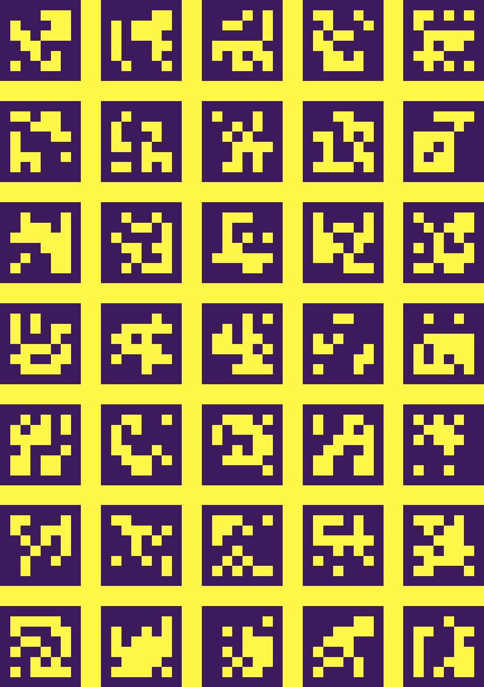

# Fast 3D Reconstruction of Food Surface and Volume Estimation

This repo includes the code for my diploma thesis.


## Abstract
The purpose of this diploma thesis is the implementation of a system capable of
computing food volume by capturing a short video from an arbitrary device that has
a digital camera. For this reason, food’s three dimensional surface is reconstructed.
Camera’s intrinsic and extrinsic parameters are estimated by using a specially designed
placemat, which is also used to detect the food in an image through a process that
was designed for this thesis. There are two different reconstruction methods presented,
one aiming to track the food pixels in consecutive frames while the other to estimate a
depth map. Finally, both methods are evaluated through a dataset of 28 different meals
with known volumes, by calculating the volume error and measuring the time needed for
volume estimation and camera calibration.

## How to use
First of all, print the placemat ('aruco_board.jpg') in A3 paper (29.7x42.0 cm).

The plate that will be used must be plain with no patterns or weird textures.

Record two videos for each one of the aforementioned methods:

1. A video recording by moving freely the camera around the food in circular motion. It is
better to keep a constant distance from the plate. Also, the placemat should be clearly visible, 
so keep the camera at the top and not too close to the table. The duration of
the video will be ~15 sec.
2. A video recording directly above the plate, facing vertically to it. The recording will be from
left hand side to right hand side (preferably in landscape mode), by just moving the camera horizontally. The duration of
the video will be ~8 sec.

## Run the code
Install dependencies from setup.py by typing

```bash
pip install -e .
```

To calculate the volume run the functions volume_with_pixel_tracking and volume_with_stereo_matching 
by passing the path to the first and second video respectively as parameters. 

```python
from volume_calculation import volume_with_stereo_matching, volume_with_pixel_tracking

volume1 = volume_with_pixel_tracking('path_to_video_1')
volume2 = volume_with_stereo_matching('path_to_video_2')
```

## Placemat


